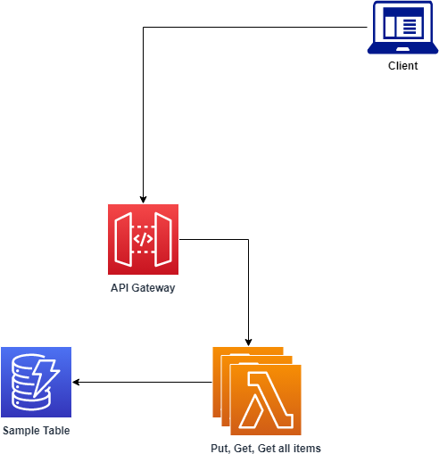

# {{cookiecutter.project_name}}

This project contains source code and supporting files for a serverless application that you can deploy with the AWS Serverless Application Model (AWS SAM) command line interface (CLI). It includes the following files and folders:

- `src` - Code for the application's Lambda function.
- `events` - Invocation events that you can use to invoke the function.
- `__tests__` - Unit tests for the application code. 
- `template.yaml` - A template that defines the application's AWS resources.

The application uses several AWS resources, including Lambda functions, an API Gateway API, an S3 Bucket with a CloudFront Distribution and Amazon DynamoDB tables. These resources are defined in the `template.yaml` file in this project. You can update the template to add AWS resources through the same deployment process that updates your application code.

This template addresses the challenge developers can face when adding a front-end to a standard serverless backend. See below for a diagram that represents a standard serverless backend:



This template adds the following components to the standard serverless backend which provides the foundation for further development of a single page app frontend to allow your users to interact with your api:


How does it work? When the full stack is deployed, the end result is a single page web application hosted on S3/CloudFront that allows users to interact with the serverless API that is created by this project.

If you prefer to use an integrated development environment (IDE) to build and test your application, you can use the AWS Toolkit.  
The AWS Toolkit is an open-source plugin for popular IDEs that uses the AWS SAM CLI to build and deploy serverless applications on AWS. The AWS Toolkit also adds step-through debugging for Lambda function code. 

To get started, see the following:

* [CLion](https://docs.aws.amazon.com/toolkit-for-jetbrains/latest/userguide/welcome.html)
* [GoLand](https://docs.aws.amazon.com/toolkit-for-jetbrains/latest/userguide/welcome.html)
* [IntelliJ](https://docs.aws.amazon.com/toolkit-for-jetbrains/latest/userguide/welcome.html)
* [WebStorm](https://docs.aws.amazon.com/toolkit-for-jetbrains/latest/userguide/welcome.html)
* [Rider](https://docs.aws.amazon.com/toolkit-for-jetbrains/latest/userguide/welcome.html)
* [PhpStorm](https://docs.aws.amazon.com/toolkit-for-jetbrains/latest/userguide/welcome.html)
* [PyCharm](https://docs.aws.amazon.com/toolkit-for-jetbrains/latest/userguide/welcome.html)
* [RubyMine](https://docs.aws.amazon.com/toolkit-for-jetbrains/latest/userguide/welcome.html)
* [DataGrip](https://docs.aws.amazon.com/toolkit-for-jetbrains/latest/userguide/welcome.html)
* [VS Code](https://docs.aws.amazon.com/toolkit-for-vscode/latest/userguide/welcome.html)
* [Visual Studio](https://docs.aws.amazon.com/toolkit-for-visual-studio/latest/user-guide/welcome.html)

## Deploy the sample application

The AWS SAM CLI is an extension of the AWS CLI that adds functionality for building and testing Lambda applications. It uses Docker to run your functions in an Amazon Linux environment that matches Lambda. It can also emulate your application's build environment and API.

To use the AWS SAM CLI, you need the following tools:

* AWS SAM CLI - [Install the AWS SAM CLI](https://docs.aws.amazon.com/serverless-application-model/latest/developerguide/serverless-sam-cli-install.html).
* Node.js - [Install Node.js 20](https://nodejs.org/en/), including the npm package management tool.
* Docker - [Install Docker community edition](https://hub.docker.com/search/?type=edition&offering=community).

To build and deploy your application for the first time, run the following in your shell:

```bash
sam build
sam deploy --guided
```

The first command will build the source of your application. The second command will package and deploy your application to AWS, with a series of prompts:

* **Stack Name**: The name of the stack to deploy to CloudFormation. This should be unique to your account and region, and a good starting point would be something matching your project name.
* **AWS Region**: The AWS region you want to deploy your app to.
* **Confirm changes before deploy**: If set to yes, any change sets will be shown to you before execution for manual review. If set to no, the AWS SAM CLI will automatically deploy application changes.
* **Allow SAM CLI IAM role creation**: Many AWS SAM templates, including this example, create AWS IAM roles required for the AWS Lambda function(s) included to access AWS services. By default, these are scoped down to minimum required permissions. To deploy an AWS CloudFormation stack which creates or modifies IAM roles, the `CAPABILITY_IAM` value for `capabilities` must be provided. If permission isn't provided through this prompt, to deploy this example you must explicitly pass `--capabilities CAPABILITY_IAM` to the `sam deploy` command.
* **Save arguments to samconfig.toml**: If set to yes, your choices will be saved to a configuration file inside the project, so that in the future you can just re-run `sam deploy` without parameters to deploy changes to your application.

The following outputs will be displayed in the outputs when the deployment is complete:
* API Gateway endpoint API 
* CloudFront Distribution ID
* CloudFront domain name
* S3 Bucket for Front End source files

## Deploy the Front End
For convenience, the included deploy_frontend.sh bash script can be run to automatically deploy your front end website to your AWS account. Run using the following command:
```bash
./deploy_frontend.sh
```

## Regarding CORS
For security, it is recommended to restrict the Allowed Origin value to restrict HTTP requests that are initiated from scripts running in the browser. See here for more information:
* Configuring CORS for an HTTP API - [Configuring CORS for an HTTP API](https://docs.aws.amazon.com/apigateway/latest/developerguide/http-api-cors.html).

## Use the AWS SAM CLI to build and test locally

Build your application by using the `sam build` command.

```bash
my-application$ sam build
```

The AWS SAM CLI installs dependencies that are defined in `package.json`, creates a deployment package, and saves it in the `.aws-sam/build` folder.

Test a single function by invoking it directly with a test event. An event is a JSON document that represents the input that the function receives from the event source. Test events are included in the `events` folder in this project.

Run functions locally and invoke them with the `sam local invoke` command.

```bash
my-application$ sam local invoke putItemFunction --event events/event-post-item.json
my-application$ sam local invoke getAllItemsFunction --event events/event-get-all-items.json
```

The AWS SAM CLI can also emulate your application's API. Use the `sam local start-api` command to run the API locally on port 3000.

```bash
my-application$ sam local start-api
my-application$ curl http://localhost:3000/
```

The AWS SAM CLI reads the application template to determine the API's routes and the functions that they invoke. The `Events` property on each function's definition includes the route and method for each path. It also includes a reference to the API Gateway that is also deployed as part of this application.

```yaml
      Events:
        Api:
          Type: Api
          Properties:
            Path: /
            Method: GET
            RestApiId:
              Ref: ApiGatewayApi
```

## Test locally with dynamodb:
1. Start DynamoDB Local in a Docker container (this example works on codespace) 
```
docker run --rm -p 8000:8000 -v /tmp:/data amazon/dynamodb-local
```
2. Create the DynamoDB table (sample command below): 
```
aws dynamodb create-table --table-name SampleTable --attribute-definitions AttributeName=id,AttributeType=S --key-schema AttributeName=id,KeyType=HASH --billing-mode PAY_PER_REQUEST --endpoint-url http://127.0.0.1:8000
```
3. Retrieve the ip address of your docker container running dynamodb local:
```
docker inspect <container_name_or_id> -f  '{{range .NetworkSettings.Networks}}{{.IPAddress}}{{end}}' 
```
4. Update env.json with the IP of your docker container for the endpoint override - see here for example:
```
{
    "getByIdFunction": {
        "ENDPOINT_OVERRIDE": "http://172.17.0.2:8000",
        "SAMPLE_TABLE": "SampleTable"
    },
    "putItemFunction": {
        "ENDPOINT_OVERRIDE": "http://172.17.0.2:8000",
        "SAMPLE_TABLE": "SampleTable"
    }
}
```
5. run the following commands to start the sam local api:
```
sam local start-api --env-vars env.json --host 0.0.0.0 --debug
```
6. For testing - you can put an item into dynamodb local
```
aws dynamodb put-item \
    --table-name SampleTable \
    --item '{"id": {"S": "A1234"}, "name": {"S": "randeepx"}}' \
    --endpoint-url http://127.0.0.1:8000
```
7. How to scan your table for items
```
aws dynamodb scan --table-name SampleTable --endpoint-url http://127.0.0.1:8000
```
8. To run frontend application locally:
Go to your `frontend` code directory
 ```
cd frontend
```
Make backend API endpoint accessible as an environment variable. For local, create a `.env` file, Here is an example: 
```
VUE_APP_API_ENDPOINT=http://127.0.0.1:3000/
```
9. run following command to compile and run (with hot-reloads) for development
```
npm run serve
``` 
10. to execute frontend unit test
```
npm run test
``` 


## Add a resource to your application
The application template uses AWS SAM to define application resources. AWS SAM is an extension of AWS CloudFormation with a simpler syntax for configuring common serverless application resources, such as functions, triggers, and APIs. For resources that aren't included in the [AWS SAM specification](https://github.com/awslabs/serverless-application-model/blob/master/versions/2016-10-31.md), you can use the standard [AWS CloudFormation resource types](https://docs.aws.amazon.com/AWSCloudFormation/latest/UserGuide/aws-template-resource-type-ref.html).

Update `template.yaml` to add a dead-letter queue to your application. In the **Resources** section, add a resource named **MyQueue** with the type **AWS::SQS::Queue**. Then add a property to the **AWS::Serverless::Function** resource named **DeadLetterQueue** that targets the queue's Amazon Resource Name (ARN), and a policy that grants the function permission to access the queue.

```
Resources:
  MyQueue:
    Type: AWS::SQS::Queue
  getAllItemsFunction:
    Type: AWS::Serverless::Function
    Properties:
      Handler: src/handlers/get-all-items.getAllItemsHandler
      Runtime: nodejs20.x
      DeadLetterQueue:
        Type: SQS 
        TargetArn: !GetAtt MyQueue.Arn
      Policies:
        - SQSSendMessagePolicy:
            QueueName: !GetAtt MyQueue.QueueName
```

The dead-letter queue is a location for Lambda to send events that could not be processed. It's only used if you invoke your function asynchronously, but it's useful here to show how you can modify your application's resources and function configuration.

Deploy the updated application.

```bash
my-application$ sam deploy
```

Open the [**Applications**](https://console.aws.amazon.com/lambda/home#/applications) page of the Lambda console, and choose your application. When the deployment completes, view the application resources on the **Overview** tab to see the new resource. Then, choose the function to see the updated configuration that specifies the dead-letter queue.

## Fetch, tail, and filter Lambda function logs

To simplify troubleshooting, the AWS SAM CLI has a command called `sam logs`. `sam logs` lets you fetch logs that are generated by your Lambda function from the command line. In addition to printing the logs on the terminal, this command has several nifty features to help you quickly find the bug.

**NOTE:** This command works for all Lambda functions, not just the ones you deploy using AWS SAM.

```bash
my-application$ sam logs -n putItemFunction --stack-name sam-app --tail
```

**NOTE:** This uses the logical name of the function within the stack. This is the correct name to use when searching logs inside an AWS Lambda function within a CloudFormation stack, even if the deployed function name varies due to CloudFormation's unique resource name generation.

You can find more information and examples about filtering Lambda function logs in the [AWS SAM CLI documentation](https://docs.aws.amazon.com/serverless-application-model/latest/developerguide/serverless-sam-cli-logging.html).

## Unit tests

Tests are defined in the `__tests__` folder in this project. Use `npm` to install the [Jest test framework](https://jestjs.io/) and run unit tests.

```bash
my-application$ npm install
my-application$ npm run test
```

## Cleanup

To delete the sample application that you created, use the AWS CLI. Assuming you used your project name for the stack name, you can run the following:

```bash
sam delete --stack-name {{ cookiecutter.project_name }}
```

## Resources

For an introduction to the AWS SAM specification, the AWS SAM CLI, and serverless application concepts, see the [AWS SAM Developer Guide](https://docs.aws.amazon.com/serverless-application-model/latest/developerguide/what-is-sam.html).

Next, you can use the AWS Serverless Application Repository to deploy ready-to-use apps that go beyond Hello World samples and learn how authors developed their applications. For more information, see the [AWS Serverless Application Repository main page](https://aws.amazon.com/serverless/serverlessrepo/) and the [AWS Serverless Application Repository Developer Guide](https://docs.aws.amazon.com/serverlessrepo/latest/devguide/what-is-serverlessrepo.html).
